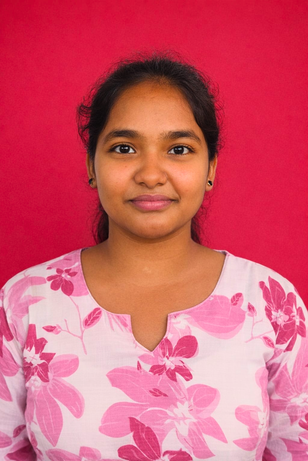

# Dark Academia Portfolio Website

A minimalist, dashboard-style portfolio website featuring a **Dark Academia** aesthetic and an integrated **AI Chatbot** trained on my resume.

 
*(Note: Replace this with a screenshot of the dashboard if available)*

## 🌟 Features

- **Dark Academia Theme**: Deep charcoal backgrounds, parchment textures, and muted gold accents.
- **Dashboard Layout**: Card-based design displaying About, Skills, Education, and Projects.
- **AI Chatbot**: A smart assistant powered by the Groq API (Llama 3) that answers questions based on my resume context.
- **Responsive Design**: Works seamlessly on desktop and mobile.

## 🛠️ Tech Stack

- **Backend**: Flask (Python)
- **Frontend**: HTML5, CSS3, JavaScript
- **AI Integration**: Groq API (Llama-3.3-70b-versatile)

## 🚀 Getting Started

### Prerequisites

- Python 3.8+
- A Groq API Key (Get one at [console.groq.com](https://console.groq.com/))

### Installation

1. **Clone the repository**:
   ```bash
   git clone https://github.com/yourusername/portfolio-website.git
   cd portfolio-website
   ```

2. **Install dependencies**:
   ```bash
   pip install -r requirements.txt
   ```

3. **Configure API Key**:
   - Open `app.py`.
   - Replace the placeholder API key with your own (or better, use environment variables):
     ```python
     client = Groq(api_key="YOUR_GROQ_API_KEY")
     ```

4. **Run the application**:
   ```bash
   python app.py
   ```

5. **Visit the site**:
   Open [http://127.0.0.1:5000](http://127.0.0.1:5000) in your browser.

## 📂 Project Structure

```
portfolio/
├── static/
│   ├── css/        # Stylesheets
│   ├── js/         # Chatbot logic
│   └── images/     # Assets
├── templates/
│   ├── base.html   # Layout template
│   └── dashboard.html # Main content
├── app.py          # Flask application server
├── requirements.txt # Dependencies
└── README.md       # Project documentation
```

## 📬 Contact

**Swayamshree Tripathy**  
📧 swayamshreetripathy.offcial@gmail.com  
📍 Berhampur, Odisha
